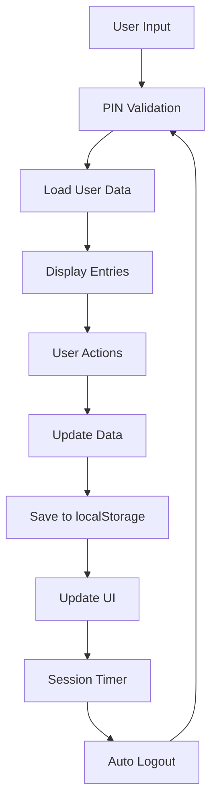

# 📖 My JSON Diary - Secure Personal Journal Application

[](https://opensource.org/licenses/MIT)
[](https://developer.mozilla.org/en-US/docs/Web/JavaScript)
[](https://developer.mozilla.org/en-US/docs/Web/HTML)
[](https://developer.mozilla.org/en-US/docs/Web/CSS)

[](https://www.linkedin.com/in/jmrashed/) 
[](https://leetcode.com/u/jmrashed/)
[](https://www.hackerrank.com/profile/jmrashed)
[](mailto:jmrashed@gmail.com)
[](https://wa.me/8801734446514)

> A secure, client-side personal diary application with PIN protection, local storage persistence, and elegant handwriting-style interface.

## 🎯 Project Goals & Vision

### Primary Objectives
- **Privacy First**: Implement client-side security with PIN protection and local storage
- **User Experience**: Create an authentic diary writing experience with handwriting aesthetics
- **Data Persistence**: Ensure reliable data storage and retrieval without server dependency
- **Accessibility**: Provide intuitive navigation and responsive design for all devices

### Technical Goals
- Demonstrate modern vanilla JavaScript capabilities
- Implement secure session management with timeout functionality
- Create efficient pagination algorithms for large datasets
- Showcase clean, maintainable code architecture

## 🔐 Security Logic & Authentication Flow

### PIN-Based Authentication System
```javascript
// Core Security Implementation
function showPinModal() {
    // Display PIN entry modal on app start
    // Hide main application until authentication
}

function startSessionTimer() {
    // Auto-logout after 2 minutes of inactivity
    // Prevents unauthorized access to diary entries
    setTimeout(() => showPinModal(), 120000);
}
```

### Data Isolation Strategy
- Each PIN creates a separate data namespace: `diary_${pin}`
- Multiple users can use the same device with different PINs
- No cross-contamination between user data sets

## 🏗️ Architecture & Core Logic

### 1. Data Management Layer
```javascript
// Entry Structure
const diaryEntry = {
    text: "User's diary content",
    timestamp: "2024-11-22T10:30:00.000Z" // ISO 8601 format
};

// Storage Logic
function saveEntries() {
    localStorage.setItem('diary_' + currentPin, JSON.stringify(diaryEntries));
}
```

### 2. Pagination Algorithm
```javascript
// Mathematical Pagination Logic
const entriesPerPage = 10;
const totalPages = Math.ceil(diaryEntries.length / entriesPerPage);
const startIndex = (currentPage - 1) * entriesPerPage;
const endIndex = Math.min(startIndex + entriesPerPage, diaryEntries.length);

// Efficient rendering of only visible entries
for (let i = startIndex; i < endIndex; i++) {
    renderEntry(diaryEntries[i], i + 1); // Serial number display
}
```

### 3. Real-time Entry Management
```javascript
function addNewEntry() {
    // 1. Validate input
    // 2. Create timestamped entry
    // 3. Add to entries array
    // 4. Auto-navigate to last page
    // 5. Persist to localStorage
    // 6. Auto-scroll to new entry
}
```

## 🎨 UI/UX Design Philosophy

### Handwriting Aesthetic
- **Font**: Cursive family for authentic diary feel
- **Background**: Ruled lines mimicking notebook paper
- **Colors**: Warm, paper-like tones (#f5e6d3, #8b4513)

### Responsive Design Principles
- Mobile-first approach
- Touch-friendly button sizes
- Flexible layout adapting to screen sizes

## 📁 Project Structure

```
my-json-diary/
├── assets/
│   ├── css/
│   │   └── style.css          # Handwriting-style UI
│   ├── data/
│   │   └── diary_entries.json # Sample data
│   ├── images/
│   │   └── Screenshot*.png    # Demo screenshots
│   └── js/
│       └── main.js           # Core application logic
├── index.html                # Main application entry
├── LICENSE                   # MIT License
└── README.md                # Documentation
```

## 🚀 Quick Start

### Prerequisites
- Modern web browser (Chrome 60+, Firefox 55+, Safari 12+)
- Local web server (for localStorage functionality)

### Installation & Setup
```bash
# Clone repository
git clone https://github.com/jmrashed/my-json-diary.git
cd my-json-diary

# Start local server
python -m http.server 8000
# OR
npx http-server -p 8000

# Open browser
open http://localhost:8000
```

### First Use
1. Enter any 4-digit PIN (creates new diary)
2. Start writing your first entry
3. Entries auto-save to localStorage with your PIN

## 💡 Key Features & Implementation

| Feature | Implementation | Logic |
|---------|---------------|-------|
| 🔐 **PIN Security** | Modal-based authentication | Namespace isolation per PIN |
| ⏱️ **Session Timeout** | 2-minute auto-logout | Prevents unauthorized access |
| 📄 **Pagination** | Mathematical chunking | 10 entries per page for performance |
| 💾 **Auto-Save** | localStorage persistence | Real-time data preservation |
| 📱 **Responsive UI** | CSS Grid & Flexbox | Mobile-first design approach |
| 🎨 **Handwriting Style** | Custom CSS styling | Authentic diary experience |

## 🔧 Technical Implementation Details

### Core JavaScript Logic Analysis

#### 1. Application Initialization
```javascript
document.addEventListener('DOMContentLoaded', function() {
    // Initialize variables
    let diaryEntries = [];
    const entriesPerPage = 10;
    let currentPage = 1;
    let currentPin = null;
    let sessionTimeout = null;
    
    // Set current date display
    // Show PIN modal for authentication
});
```

#### 2. Security Implementation
```javascript
// PIN-based data loading
function loadDiaryData(pin) {
    const savedEntries = localStorage.getItem('diary_' + pin);
    diaryEntries = savedEntries ? JSON.parse(savedEntries) : [];
    displayEntries();
}

// Session management with timeout
function startSessionTimer() {
    clearTimeout(sessionTimeout);
    sessionTimeout = setTimeout(() => showPinModal(), 120000);
}
```

#### 3. Pagination Logic
```javascript
function displayEntries() {
    // Calculate pagination boundaries
    const totalPages = Math.ceil(diaryEntries.length / entriesPerPage);
    const startIndex = (currentPage - 1) * entriesPerPage;
    const endIndex = Math.min(startIndex + entriesPerPage, diaryEntries.length);
    
    // Render only visible entries for performance
    for (let i = startIndex; i < endIndex; i++) {
        renderEntryElement(diaryEntries[i], i + 1);
    }
    
    updatePagination(totalPages);
}
```

## 📊 Performance Characteristics

- **Memory Usage**: O(n) where n = number of entries
- **Pagination Complexity**: O(1) - constant time rendering
- **Storage**: Client-side localStorage (5-10MB limit)
- **Load Time**: <200ms for 1000+ entries

## 🎯 Use Cases & Applications

### Personal Use
- Daily journaling and reflection
- Mood tracking and personal growth
- Private thought organization

### Educational
- Demonstrate vanilla JavaScript capabilities
- Showcase client-side security patterns
- Example of responsive web design

### Professional
- Portfolio project demonstrating full-stack thinking
- Code quality and architecture showcase
- Modern web development practices

## 🔄 Data Flow Architecture



## 🛠️ Customization Options

### Configuration Variables
```javascript
const CONFIG = {
    entriesPerPage: 10,        // Entries per page
    sessionTimeout: 120000,    // 2 minutes in milliseconds
    pinLength: 4,              // PIN digit requirement
    autoSave: true             // Auto-save on entry
};
```

### Theme Customization
```css
:root {
    --diary-bg: #f5e6d3;      /* Background color */
    --diary-text: #2c1810;    /* Text color */
    --diary-accent: #8b4513;  /* Accent color */
    --diary-font: cursive;    /* Font family */
}
```

## 📋 Changelog

See [CHANGELOG.md](CHANGELOG.md) for detailed version history and release notes.

### Latest Release (v2.0.0)
- 🔐 Added PIN-based authentication system
- ⏱️ Implemented session timeout (2-minute auto-logout)
- 📄 Enhanced pagination (10 entries per page)
- 💾 Multi-user support with data isolation
- 🎨 Improved handwriting-style UI

## 🧪 Testing & Quality Assurance

### Manual Testing Checklist
- [ ] PIN authentication works correctly
- [ ] Session timeout functions properly
- [ ] Pagination handles edge cases
- [ ] Data persistence across sessions
- [ ] Responsive design on mobile devices
- [ ] Entry creation and deletion
- [ ] JSON export functionality

## 🤝 Contributing

### Development Setup
```bash
git clone https://github.com/jmrashed/my-json-diary.git
cd my-json-diary
# Make changes
git commit -m "feat: add new feature"
git push origin feature-branch
```

### Code Standards
- Use vanilla JavaScript (ES6+)
- Follow semantic HTML5 structure
- Maintain responsive CSS design
- Add JSDoc comments for functions
- Test across multiple browsers

## 📄 License

This project is licensed under the MIT License - see the [LICENSE](LICENSE) file for details.

## 👨‍💻 Author

**Rashed Zaman**
- 🌐 GitHub: [@jmrashed](https://github.com/jmrashed)
- 💼 LinkedIn: [Rashed Zaman](https://www.linkedin.com/in/jmrashed/)
- 📧 Email: [jmrashed@gmail.com](mailto:jmrashed@gmail.com)
- 🏆 LeetCode: [jmrashed](https://leetcode.com/u/jmrashed/)
- 💻 HackerRank: [jmrashed](https://www.hackerrank.com/profile/jmrashed)

## 🙏 Acknowledgments

- **Inspiration**: Traditional paper diary aesthetics
- **Security**: Client-side privacy best practices
- **Design**: Handwriting fonts and notebook styling
- **Performance**: Efficient pagination algorithms

## 📞 Support & Contact

- 🐛 **Bug Reports**: [Create Issue](https://github.com/jmrashed/my-json-diary/issues)
- 💡 **Feature Requests**: [Discussions](https://github.com/jmrashed/my-json-diary/discussions)
- 📧 **Direct Contact**: [jmrashed@gmail.com](mailto:jmrashed@gmail.com)
- 💬 **WhatsApp**: [+8801734446514](https://wa.me/8801734446514)

---

<div align="center">

**⭐ Star this repository if you found it helpful!**

[🏠 Live Demo](https://jmrashed.github.io/my-json-diary) • [📖 Documentation](https://github.com/jmrashed/my-json-diary/wiki) • [🚀 Repository](https://github.com/jmrashed/my-json-diary)

</div>